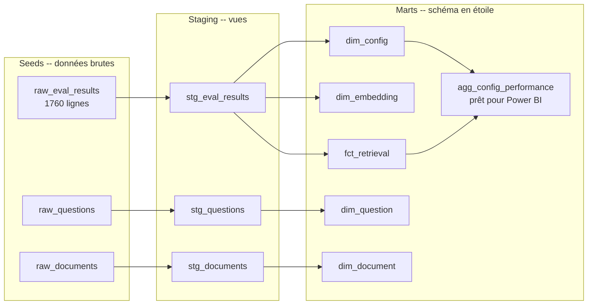
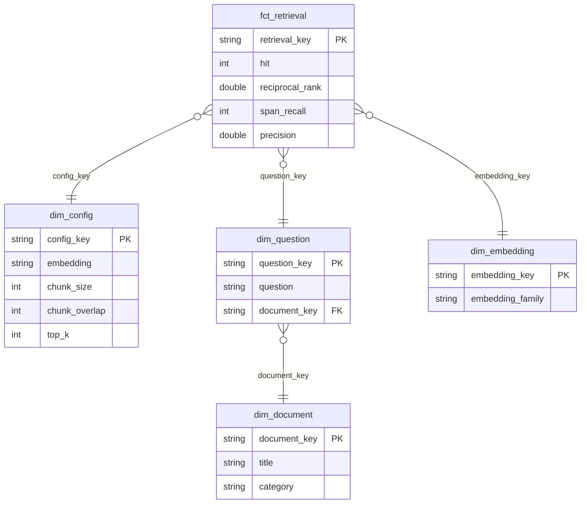

# RAG DataOps — pipeline de données industrialisé (dbt + CI/CD + IaC)


Un pipeline **DataOps** qui industrialise les résultats d'évaluation du
[Projet 1](../rag-eval-tuning) : il les charge, les transforme avec **dbt** en un
**schéma en étoile**, applique des **tests de qualité de données**, le tout rejoué
automatiquement en **CI/CD** (GitHub Actions) et conteneurisé avec **Docker**. Une
cible **BigQuery** (via Terraform) montre la portabilité vers le cloud.

> **L'angle du projet :** transformer une analyse ponctuelle (le sweep du Projet 1)
> en un **actif de données gouverné, testé et reproductible** — standardisation, tests
> de non-régression, reproductibilité : le vocabulaire exact des offres DataOps.

## Ce que fait le pipeline

- **Charge** les résultats d'évaluation RAG (1 760 lignes, grain configuration × question)
  et les référentiels (questions, documents) comme *seeds* dbt.
- **Transforme** en couches `staging` (nettoyage, clés de substitution) puis `marts`
  (schéma en étoile : dimensions + table de faits + agrégat prêt pour la BI).
- **Teste la qualité** : 37 tests dbt (unicité, non-nullité, valeurs acceptées,
  **intégrité référentielle**, plage de valeurs, cohérence métier).
- **Rejoue tout en CI** à chaque push (badge de build vert), sans secret ni compte cloud.
- **Se conteneurise** (`docker build` → `dbt build`) pour une exécution reproductible.
- **Se déploie sur BigQuery** via Terraform, sans changer une ligne de modèle dbt.

## Lignage du pipeline



## Schéma en étoile



Le mart `agg_config_performance` reconstruit, **dans l'entrepôt**, le classement des
configurations du Projet 1 (meilleure : `tfidf · size=80 · overlap=40`, hit_rate = 1.0).

## Tests de qualité de données

| Test | Type | Ce qu'il garantit |
|------|------|-------------------|
| `unique`, `not_null` | générique | Clés de substitution valides (dimensions & faits) |
| `relationships` | générique | **Intégrité référentielle** faits → dimensions (aucune clé orpheline) |
| `accepted_values` | générique | `hit`/`span_recall` ∈ {0,1} ; `category` dans un ensemble fermé |
| `accepted_range` | **générique maison** | `hit_rate` reste dans [0, 1] |
| `assert_reciprocal_rank_consistency` | **singulier** | `reciprocal_rank` cohérent avec `hit` (règle métier) |

Résultat d'exécution : `PASS=49 WARN=0 ERROR=0` (`dbt build`).

## Démarrage rapide

### En local (DuckDB, aucun compte cloud)

```bash
pip install -r requirements.txt
dbt build --profiles-dir .        # seed + run + test
dbt docs generate --profiles-dir . && dbt docs serve --profiles-dir .   # lineage interactif
```

### Avec Docker

```bash
docker build -t rag-dataops .
docker run --rm rag-dataops       # rejoue seed + run + test dans un conteneur
```

### Sur BigQuery (cloud)

```bash
cd terraform && terraform init && terraform apply -var="project_id=mon-projet-gcp"
GCP_PROJECT=mon-projet-gcp GCP_KEYFILE=/chemin/gcp.json \
    dbt build --profiles-dir . --target prod
```

## CI/CD

Le workflow [`.github/workflows/ci.yml`](.github/workflows/ci.yml) rejoue **l'intégralité
du pipeline** (`dbt build`) et génère la documentation à chaque push/PR. Comme tout tourne
sur DuckDB, la CI est **déterministe et sans secret** — un vrai test de non-régression sur
les données et leurs transformations.

## Structure du dépôt

```
rag-dataops/
├── seeds/                     # données brutes (résultats d'éval + référentiels)
├── models/
│   ├── staging/               # nettoyage + clés (vues)
│   │   ├── stg_eval_results.sql
│   │   ├── stg_questions.sql
│   │   ├── stg_documents.sql
│   │   └── _staging__models.yml   # tests
│   └── marts/                 # schéma en étoile (tables)
│       ├── dim_config.sql · dim_question.sql · dim_document.sql · dim_embedding.sql
│       ├── fct_retrieval.sql
│       ├── agg_config_performance.sql
│       └── _marts__models.yml     # tests + intégrité référentielle
├── tests/                     # test singulier (règle métier)
├── macros/                    # test générique maison (accepted_range)
├── terraform/                 # IaC : dataset BigQuery + compte de service
├── .github/workflows/ci.yml   # CI/CD dbt
├── Dockerfile · Makefile · profiles.yml · dbt_project.yml
```

## Comment les trois projets s'enchaînent

1. **Projet 1 (RAG + tuning)** produit les résultats d'évaluation.
2. **Projet 2 (full stack)** expose le RAG dans une application web.
3. **Projet 3 (ici)** industrialise les données : chargement, modélisation en étoile,
   tests de qualité, CI/CD, conteneurisation, portabilité cloud.

Un seul produit cohérent, en trois couches.

## Limites (honnêteté)

Projet d'**apprentissage**. L'entrepôt est petit (DuckDB local), les données proviennent
d'une évaluation contrôlée, et la cible BigQuery n'est pas déployée par défaut (elle
nécessite un compte GCP). L'objectif assumé : montrer une **maîtrise concrète du socle
DataOps** — dbt, tests de qualité, CI/CD, Docker, IaC.

## Stack

dbt · DuckDB (local) / BigQuery (cloud) · GitHub Actions · Docker · Terraform.

---

*Licence MIT.*
